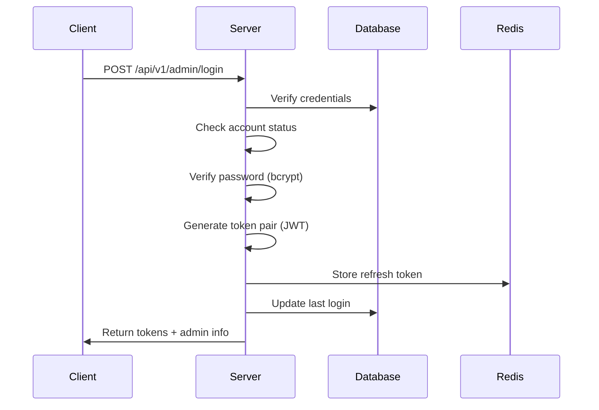
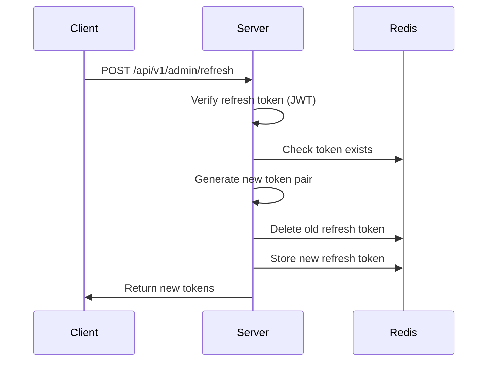
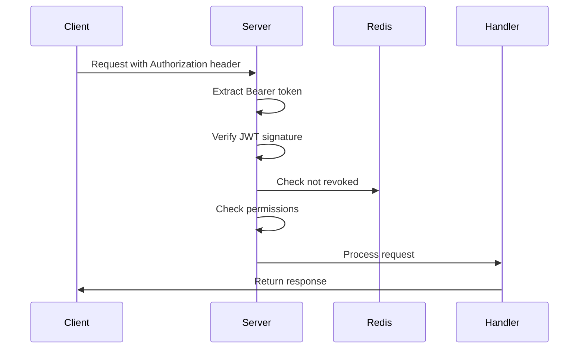

# Admin Authentication Guide

Complete guide for TrainBlink's admin authentication system with JWT tokens and RBAC permissions.

## Table of Contents
- [Overview](#overview)
- [Quick Start](#quick-start)
- [Authentication Flow](#authentication-flow)
- [API Endpoints](#api-endpoints)
- [Permissions & RBAC](#permissions--rbac)
- [Security Features](#security-features)

## Overview

TrainBlink Phase 2 implements a complete JWT-based authentication system for admin users with:

- **JWT Token Pairs**: Access tokens (1 hour) + Refresh tokens (7 days)
- **RBAC Permissions**: Role-based access control with wildcard support
- **Account Security**: Failed login lockout, password hashing (bcrypt)
- **Token Revocation**: Redis-backed token revocation list
- **Session Management**: Refresh token rotation

## Quick Start

### 1. Setup Environment

Ensure your `.env` file has the required configuration:

```bash
# Database
DB_HOST=localhost
DB_PORT=5432
DB_USER=trainblink_user
DB_PASSWORD=your_password
DB_NAME=trainblink

# Redis
REDIS_ADDR=localhost:6379
REDIS_PASSWORD=

# JWT (IMPORTANT: Change this!)
JWT_SECRET_KEY=your_super_secret_jwt_key_minimum_32_chars
JWT_ACCESS_TOKEN_TTL=3600       # 1 hour
JWT_REFRESH_TOKEN_TTL=604800    # 7 days
```

### 2. Start Services

```bash
# Start PostgreSQL and Redis
docker-compose up -d

# Run migrations (automatic on server start)
# OR manually: migrate -path migrations -database "postgresql://..." up
```

### 3. Create First Admin

```bash
go run scripts/create_admin.go admin@trainblink.com SecurePass123 "Super Admin"
```

Output:
```
✅ Admin created successfully!

Admin Details:
   ID: 550e8400-e29b-41d4-a716-446655440000
   Email: admin@trainblink.com
   Name: Super Admin
   Role: super_admin
   Permissions: [*]
   Is Active: true
```

### 4. Start Server

```bash
go run cmd/server/main_phase2.go
```

## Authentication Flow

### Login Flow



### Token Refresh Flow



### Authenticated Request Flow



## API Endpoints

### Public Endpoints (No Auth Required)

#### POST /api/v1/admin/login

Login and get token pair.

**Request:**
```json
{
  "email": "admin@trainblink.com",
  "password": "SecurePass123"
}
```

**Response (200 OK):**
```json
{
  "status": "success",
  "data": {
    "admin": {
      "id": "550e8400-e29b-41d4-a716-446655440000",
      "email": "admin@trainblink.com",
      "name": "Super Admin",
      "role": "super_admin",
      "permissions": ["*"],
      "is_active": true,
      "created_at": "2025-11-20T10:00:00Z"
    },
    "access_token": "eyJhbGciOiJIUzI1NiIs...",
    "refresh_token": "eyJhbGciOiJIUzI1NiIs...",
    "expires_in": 3600
  }
}
```

**Error Responses:**
- `401 INVALID_CREDENTIALS`: Wrong email/password
- `403 ACCOUNT_LOCKED`: Too many failed attempts
- `403 ACCOUNT_INACTIVE`: Account disabled

#### POST /api/v1/admin/refresh

Refresh access token using refresh token.

**Request:**
```json
{
  "refresh_token": "eyJhbGciOiJIUzI1NiIs..."
}
```

**Response (200 OK):**
```json
{
  "status": "success",
  "data": {
    "admin": { /* admin info */ },
    "access_token": "eyJhbGciOiJIUzI1NiIs...",
    "refresh_token": "eyJhbGciOiJIUzI1NiIs...",
    "expires_in": 3600
  }
}
```

### Authenticated Endpoints

All authenticated endpoints require:
```
Authorization: Bearer <access_token>
```

#### POST /api/v1/admin/logout

Logout and revoke tokens.

**Request:**
```json
{
  "refresh_token": "eyJhbGciOiJIUzI1NiIs..."
}
```

**Response (200 OK):**
```json
{
  "status": "success",
  "message": "Logged out successfully"
}
```

#### POST /api/v1/admin/create

Create new admin user. **Requires permission: `admin.create`**

**Request:**
```json
{
  "email": "moderator@trainblink.com",
  "name": "Moderator User",
  "password": "SecurePass456",
  "role": "moderator"
}
```

**Response (201 Created):**
```json
{
  "status": "success",
  "data": {
    "id": "660e9500-f39c-51e5-b827-557766551111",
    "email": "moderator@trainblink.com",
    "name": "Moderator User",
    "role": "moderator",
    "permissions": ["user.view", "user.ban", "content.*", "report.*"],
    "is_active": true,
    "created_at": "2025-11-20T11:00:00Z"
  }
}
```

#### GET /api/v1/admin/list

List all admins with pagination. **Requires permission: `admin.view`**

**Query Parameters:**
- `page` (default: 1)
- `page_size` (default: 20, max: 100)

**Example:** `GET /api/v1/admin/list?page=1&page_size=20`

**Response (200 OK):**
```json
{
  "status": "success",
  "data": {
    "admins": [/* array of admin objects */],
    "total": 42,
    "page": 1,
    "page_size": 20
  }
}
```

#### GET /api/v1/admin/roles

List all available roles. **Requires permission: `admin.view`**

**Response (200 OK):**
```json
{
  "status": "success",
  "data": [
    {
      "id": "super_admin",
      "name": "Super Administrator",
      "description": "Full system access",
      "permissions": ["*"],
      "created_at": "2025-11-20T00:00:00Z"
    },
    {
      "id": "admin",
      "name": "Administrator",
      "description": "Manage users and content",
      "permissions": ["user.*", "content.*", "report.*", "station.*", "analytics.view"]
    },
    {
      "id": "moderator",
      "name": "Moderator",
      "description": "Review reports and moderate content",
      "permissions": ["user.view", "user.ban", "content.view", "content.delete", "report.*"]
    }
  ]
}
```

## Permissions & RBAC

### Permission Format

Permissions use dot notation: `resource.action`

Examples:
- `user.view` - View users
- `user.create` - Create users
- `user.ban` - Ban users
- `content.*` - All content actions
- `*` - All permissions (super admin)

### Default Roles

| Role | Permissions | Description |
|------|-------------|-------------|
| `super_admin` | `*` | Full system access |
| `admin` | `user.*`, `content.*`, `report.*`, `station.*`, `analytics.view` | Manage users and content |
| `moderator` | `user.view`, `user.ban`, `content.view`, `content.delete`, `report.*` | Review reports and moderate content |

### Wildcard Matching

The permission system supports wildcards:

```go
// Super admin with "*"
permissions: ["*"]  // Matches everything

// Category wildcard
permissions: ["user.*"]  // Matches: user.view, user.create, user.update, etc.

// Exact match
permissions: ["user.view"]  // Only matches user.view
```

### Checking Permissions in Code

```go
// In middleware
middleware.RequirePermission("user.create")

// In service layer
if claims.HasPermission("user.ban") {
    // Allow action
}
```

## Security Features

### Password Security

- **Hashing**: bcrypt with default cost (10)
- **Minimum Length**: 8 characters (enforced in CreateAdminRequest)
- **Never Logged**: Password fields have `json:"-"` tag

### Account Lockout

- **Failed Attempts**: Max 5 failed login attempts
- **Lockout Duration**: 15 minutes
- **Reset**: Counter resets on successful login

### Token Security

- **Algorithm**: HS256 (HMAC with SHA-256)
- **Secret Key**: Minimum 32 characters required
- **Access Token TTL**: 1 hour (configurable)
- **Refresh Token TTL**: 7 days (configurable)
- **Token Revocation**: Redis-backed revocation list

### Token Storage (Client-side)

**Recommended:**
- Store access token in memory (React state, Vue store)
- Store refresh token in httpOnly cookie or secure storage
- Never store tokens in localStorage (XSS vulnerability)

### Rate Limiting

Redis-based rate limiting available:
```go
// In main server
handler = middleware.IPRateLimitMiddleware(redisService, 100)(handler)  // 100 req/min
```

## Testing with curl

### 1. Login
```bash
curl -X POST http://localhost:8080/api/v1/admin/login \
  -H "Content-Type: application/json" \
  -d '{
    "email": "admin@trainblink.com",
    "password": "SecurePass123"
  }'
```

### 2. Use Access Token
```bash
# Save token from login response
TOKEN="eyJhbGciOiJIUzI1NiIs..."

curl -X GET http://localhost:8080/api/v1/admin/list \
  -H "Authorization: Bearer $TOKEN"
```

### 3. Refresh Token
```bash
REFRESH_TOKEN="eyJhbGciOiJIUzI1NiIs..."

curl -X POST http://localhost:8080/api/v1/admin/refresh \
  -H "Content-Type: application/json" \
  -d "{\"refresh_token\": \"$REFRESH_TOKEN\"}"
```

### 4. Logout
```bash
curl -X POST http://localhost:8080/api/v1/admin/logout \
  -H "Authorization: Bearer $TOKEN" \
  -H "Content-Type: application/json" \
  -d "{\"refresh_token\": \"$REFRESH_TOKEN\"}"
```

## Troubleshooting

### "JWT_SECRET_KEY is required"

Ensure your `.env` file has:
```bash
JWT_SECRET_KEY=your_super_secret_jwt_key_minimum_32_chars
```

Generate a secure key:
```bash
openssl rand -base64 32
```

### "Account locked due to too many failed login attempts"

Wait 15 minutes or manually reset in database:
```sql
UPDATE admins
SET failed_login_attempts = 0, locked_until = NULL
WHERE email = 'admin@trainblink.com';
```

### "Token has been revoked"

The access token was revoked on logout. Login again to get new tokens.

### "Insufficient permissions"

Your admin role doesn't have the required permission. Check with:
```bash
curl http://localhost:8080/api/v1/admin/roles
```

## Best Practices

1. **Environment Variables**: Never commit `.env` files
2. **Secret Keys**: Use strong, random keys (min 32 chars)
3. **HTTPS**: Always use HTTPS in production
4. **Token Storage**: Keep refresh tokens secure (httpOnly cookies)
5. **Permissions**: Follow least privilege principle
6. **Monitoring**: Log failed login attempts
7. **Rotation**: Rotate JWT secret keys periodically
8. **Backups**: Backup admin accounts before deletions

## Next Steps

- Implement user (mobile app) authentication with Firebase
- Add 2FA for admin accounts
- Implement audit logging for admin actions
- Add IP whitelisting for sensitive operations
- Create admin dashboard UI
